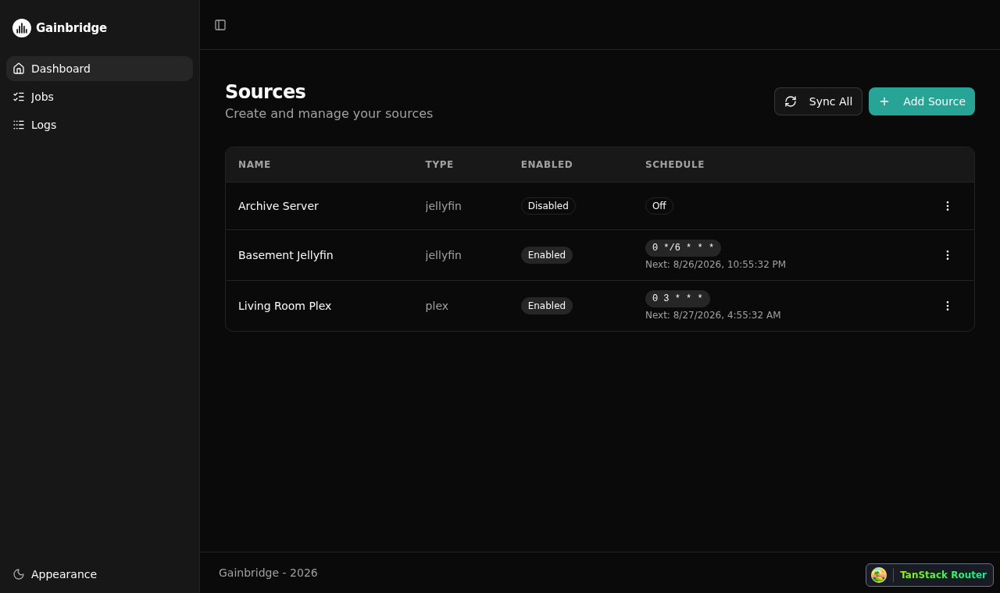
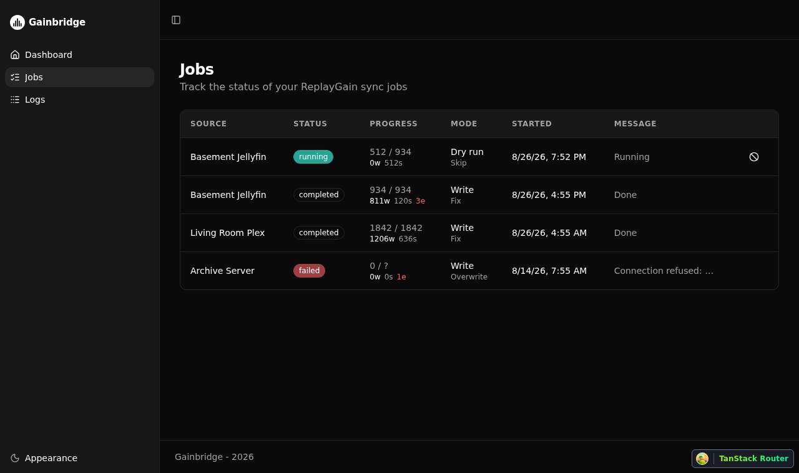
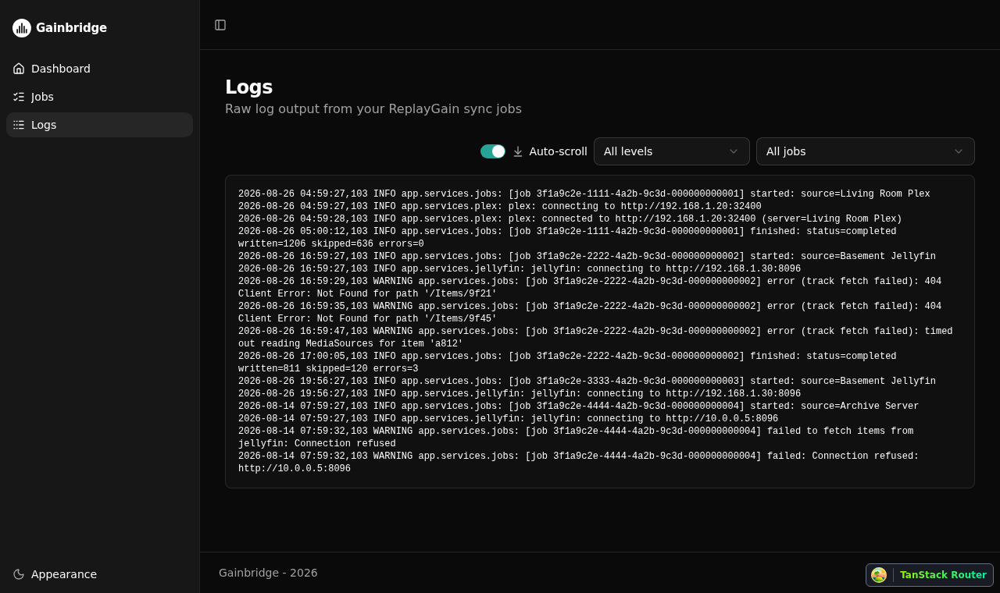
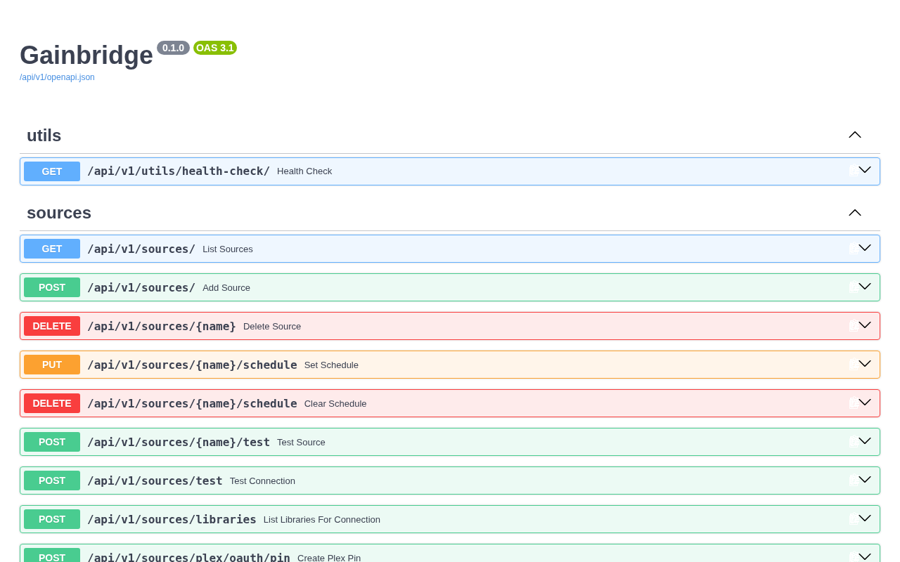

# Gainbridge

Gainbridge keeps ReplayGain/loudness tags on your music library in sync with what Plex or Jellyfin already knows, so every player that respects ReplayGain plays your library at a consistent volume.

Point it at one or more Plex or Jellyfin servers, and it periodically reads the loudness data those servers already compute and writes standard ReplayGain tags into the actual audio files - no separate loudness scan needed.

## Why

Plex and Jellyfin both analyze audio loudness for their own volume-leveling features, but that data lives in their databases, not in your files. If you ever move your library, play it through something other than Plex/Jellyfin, or just want tags that work everywhere, that analysis is locked away. Gainbridge pulls it out and writes it where it belongs: directly into the file's own ReplayGain tags (ID3 `TXXX`, MP4 freeform atoms, Vorbis comments).

## Features

- 🎧 Syncs ReplayGain tags from Plex and Jellyfin libraries.
- 🔁 Scheduled or on-demand sync jobs, scoped to a whole server or a single library.
- 🧪 Dry-run mode to preview what would change before writing anything.
- ✍️ Configurable write behavior: skip existing tags, fix only what's missing, or overwrite everything.
- 🗂️ Remote-to-local path mappings, for when your media server sees a different filesystem path than Gainbridge does.
- 📋 A Jobs view to track sync runs, and a Logs view to debug connection or file-write issues.
- 🦇 Dark mode.

## Screenshots

### Sources



### Jobs



### Logs



### Interactive API Documentation



## Technology Stack

- ⚡ [FastAPI](https://fastapi.tiangolo.com) backend, with [SQLModel](https://sqlmodel.tiangolo.com) over SQLite and [Alembic](https://alembic.sqlalchemy.org) migrations.
- 🚀 [React](https://react.dev) frontend, using TypeScript, [Vite](https://vitejs.dev), [TanStack Query](https://tanstack.com/query)/[Router](https://tanstack.com/router), [Tailwind CSS](https://tailwindcss.com), and [shadcn/ui](https://ui.shadcn.com).
- 🤖 An automatically generated frontend API client.
- 🐋 Docker Compose for local development.
- 📦 A single multi-arch (amd64/arm64) Docker image published to [Docker Hub](https://hub.docker.com/r/j3ko/gainbridge) for production.

## Quick Start

```bash
docker compose watch
```

Then open:

- Frontend: <http://localhost:5173>
- Backend API: <http://localhost:8000>
- Interactive API docs: <http://localhost:8000/docs>

From there, add a Plex or Jellyfin source with its server URL and an API token, optionally scope it to one library and set a sync schedule, and run a sync.

## Running with Docker

For production, pull the published image, which bundles the backend and frontend into a single container:

```bash
docker pull j3ko/gainbridge:latest
```

Use `:edge` instead of `:latest` to track the tip of `main` between releases.

```bash
docker run -d \
  --name gainbridge \
  -p 8000:8000 \
  -e PROJECT_NAME=Gainbridge \
  -e FIRST_SUPERUSER=admin@example.com \
  -e FIRST_SUPERUSER_PASSWORD=changethis \
  -v ./data:/app/backend/data \
  j3ko/gainbridge:latest
```

The `data/` volume mount keeps the SQLite database and log file across container restarts and upgrades. See [Configuration](#configuration) below for other environment variables.

## Configuration

Configuration lives in the top-level `.env` file. At minimum, review:

- `SQLITE_DB_FILE` / `LOG_FILE` - paths to the SQLite database and log file, by default under the top-level `data/` folder, which is bind-mounted into the backend container so it persists across restarts and redeploys.
- `BACKEND_CORS_ORIGINS` - required if the frontend is served from a different origin than the backend.

## Documentation

- [Backend development](./backend/README.md)
- [Frontend development](./frontend/README.md)
- [General development](./development.md) - Docker Compose, running services locally, pre-commit hooks.

## License

Gainbridge is licensed under the terms of the MIT license.
